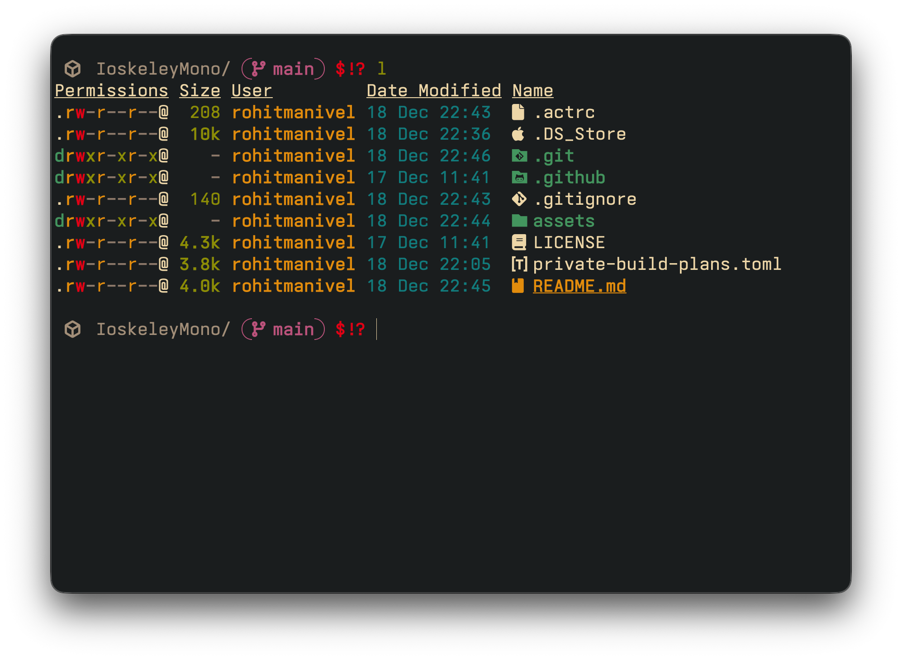
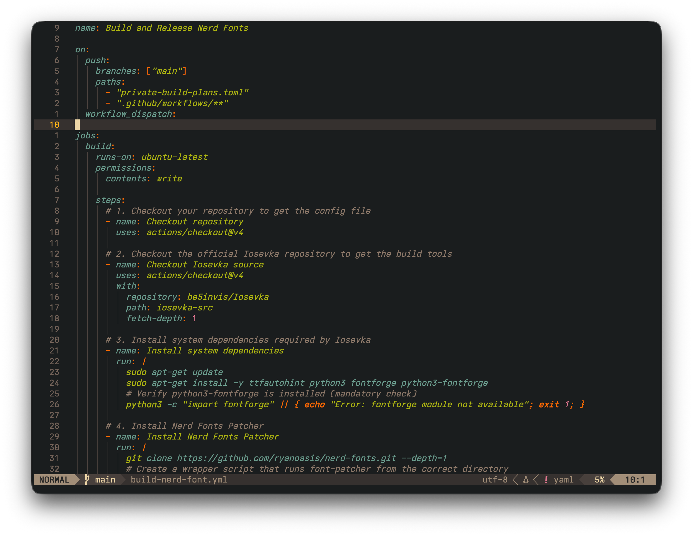
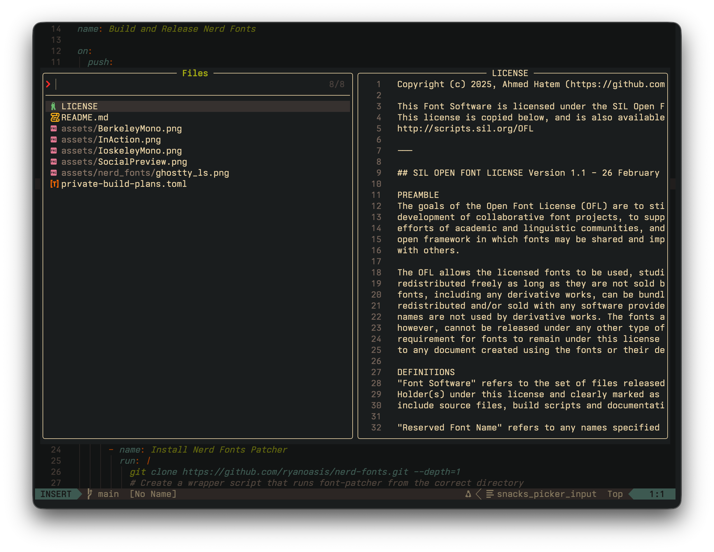

# IoskeleyMono

The goal of this project is to configure the [Iosevka](https://github.com/be5invis/Iosevka) typeface to mimic the look and feel of **Berkeley Mono** as closely as possible.

It uses Iosevka's extensive build options to select character variants that replicate the distinct aesthetic of Berkeley Mono, creating a free, open-source alternative for fans of that particular style.

The name is a simple mashup: **Iosevka** + **Berkeley** = **Ioskeley**.

This repository uses GitHub Actions to automatically build the font files whenever the configuration is updated.

---

## Installation

The easiest way to get the font is to download it directly from the **Releases** page.

1. [Click here to go to the Releases Page](https://github.com/rohit-iwnl/IoskeleyMono/releases)
2. Download the zip file for your needs (Desktop, Web, or Nerd Font versions).
3. Unzip the file and install the fonts on your system.

---

## Preview

| Ioskeley Mono                                                                   | Berkeley Mono                                                                   |
| ------------------------------------------------------------------------------- | ------------------------------------------------------------------------------- |
|  |  |

> Theme used in preview: [Kintsugi Dark Flared](https://marketplace.visualstudio.com/items?itemName=ahmedhatem.kintsugi)

---

### Configuration Choices

This configuration uses specific character variants and custom metrics to closely match the look and feel of Berkeley Mono.

- **Custom Metrics:** The font's vertical proportions, letter spacing (`sb`), and parenthesis size have been manually adjusted. This is the key to capturing Berkeley's characteristically compact and geometric feel.
- **Distinctive Characters:** Key glyphs were chosen to match, including a **single-storey `g`**, **flat-arc parentheses `()`**, and a **two-circle `8`**.
- **Clarity and Readability:** For the best coding experience, the font uses a **dotted zero**, **open-contour `6` and `9`**, and sharp, **square punctuation**.
- **High Underscore:** The underscore character is raised to ensure it is clearly visible and never blends with the line below.

For a complete list of all choices made to match Berkeley Mono, see the [`private-build-plans.toml`](./private-build-plans.toml) file.

---

### Nerd Fonts In Action

If you're using terminal tools like `lsd`, `bat`, or any of those fancy CLI utilities that show icons, you'll probably want the Nerd Fonts version. The patched version adds all those icon glyphs so your terminal doesn't show weird boxes or question marks.

> Theme used in preview: [Gruvbox Dark Hard](https://github.com/morhetz/gruvbox)

The Nerd Fonts patched versions are available in the [GitHub Releases](https://github.com/rohit-iwnl/IoskeleyMono/releases). Just grab the patched font files from there and install them like you would any other font. They include all the Nerd Fonts glyphs while keeping the Berkeley Mono aesthetic intact.

The patched fonts work great with tools like:
- Terminal file managers (ranger, lf, etc.)
- Git status indicators
- Powerline/statusline plugins
- Any tool that uses icon fonts

Basically, if you see broken icons in your terminal, grab the patched version from the releases and you're good to go.

---

### License & Credits

**Original Author**: Ioskeley Mono was created by [Ahmed Hatem](https://github.com/ahatem).

**Credits**: Ioskeley Mono is a custom configuration of the [Iosevka](https://github.com/be5invis/Iosevka) typeface. All credit for the original design and build system goes to Belleve Invis and the Iosevka contributors.

Because this is a derivative of Iosevka, it is licensed under the same **SIL Open Font License 1.1**. See the `LICENSE` file for full details.
